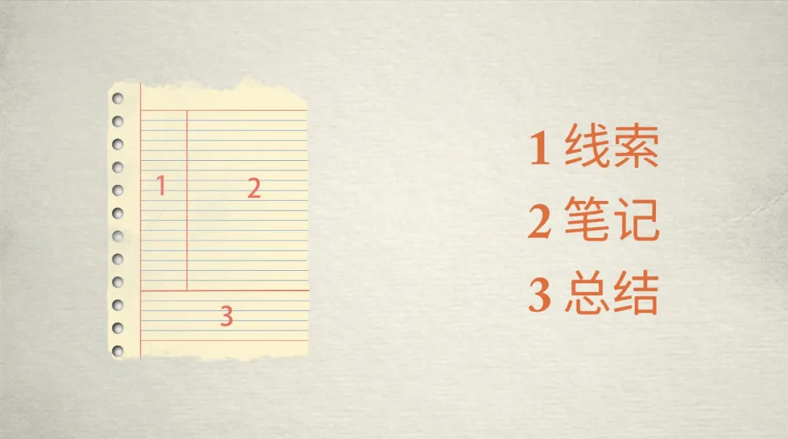
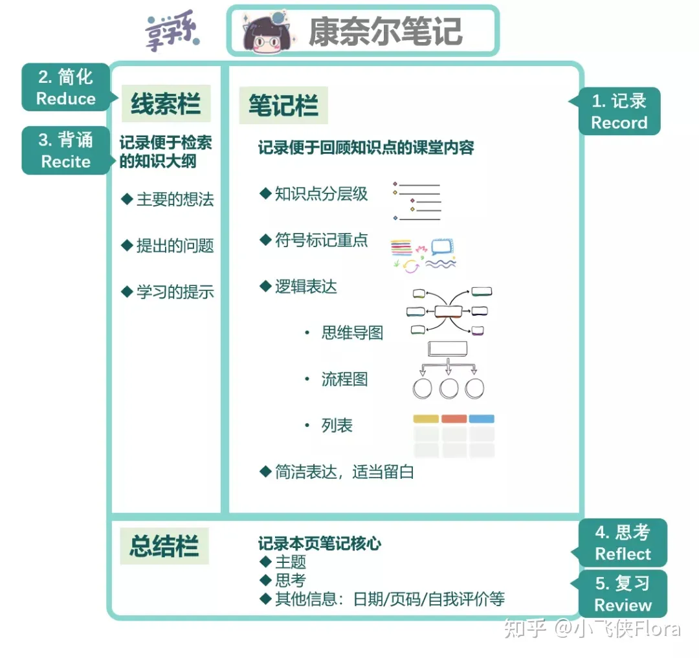
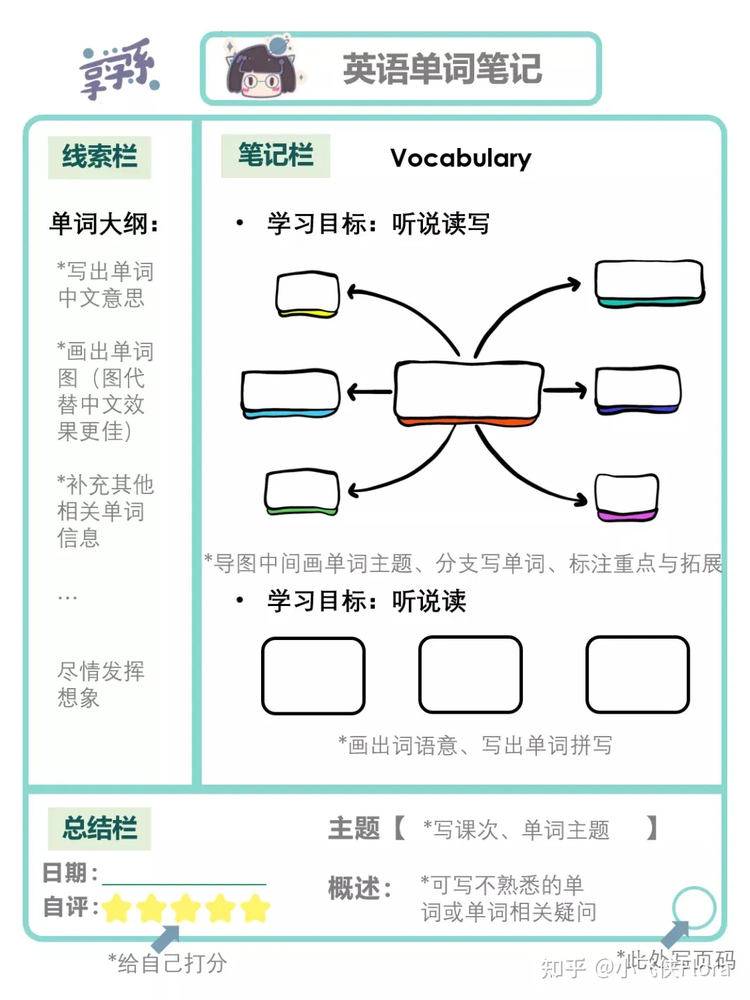
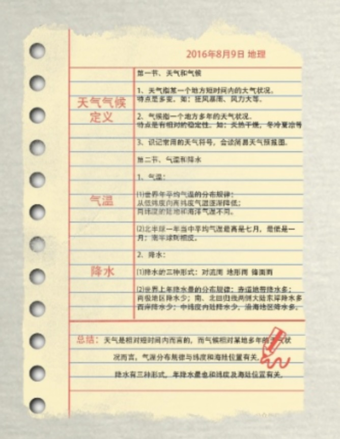

# 康奈尔笔记(5R笔记法)
## why
* 上课时知识点的思考很重要，记笔记能促进当下的自己思考学习知识
* 学习后复习需要看重点记忆，记笔记能唤醒自己对已学的知识的记忆

## 方法
* [三张图学会康奈尔笔记](https://zhuanlan.zhihu.com/p/373185401)

### 布局
* 三个区域：线索(cues)是1，内容是大纲和要点；笔记(notes)是2；总结(summary)是3，内容是总结和思考

### 步骤
* 五步：记录(2)，简化(1)，复述(1-2)，思考(3)，复习(1&3-2)

* 示例

