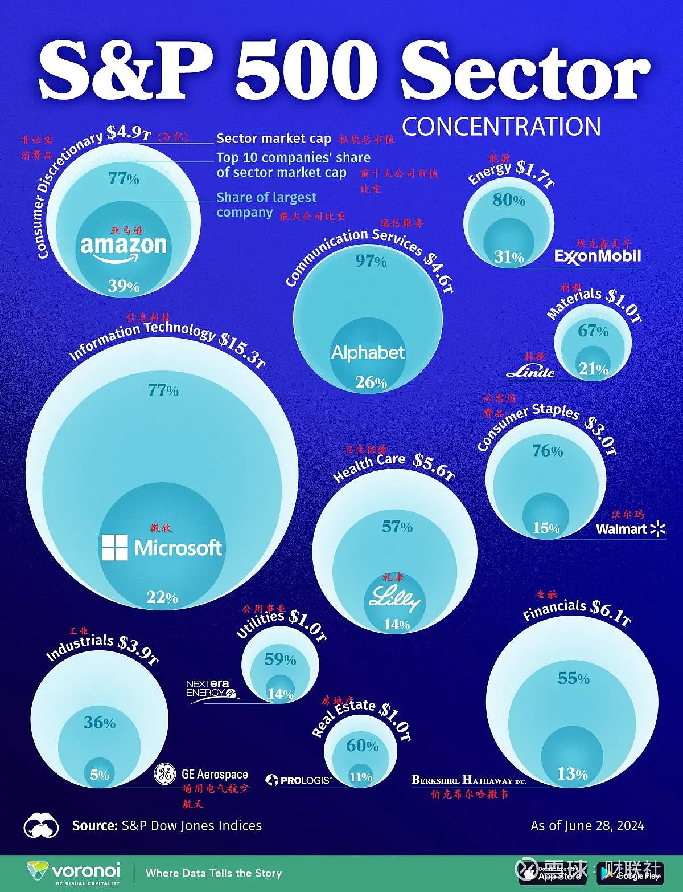

# 金融
## 投资
### 术语
| 项 | 全称 | 公式 | 反映 | 均值 | 大于均值 | 小于均值 |
| - | - | - | - | - | - | - |
| PE | Price to Earnings，市盈率 | 市值 / 净利润 OR 股票价格 / 每股收益 | 投资者对公司未来盈利能力的预期 | 15-20 | 投资者预期公司未来盈利增长较高 | 投资者预期公司未来盈利增长较低 |
| EPS | Earnings Per Share，每股收益 | 净利润 / 总股数 | 反映公司每股股票所获得的净利润，是衡量公司盈利能力的重要指标 | 不同行业不同 | 公司盈利能力较强 | 公司盈利能力较弱 |
| PB | Price to Book，市净率 | 股票价格 / 每股净资产 | 公司市场价值与其账面价值的比率，市场对公司资产价值的评价 | 1-3 | 公司资产价值较高 | 公司资产价值较低 |
| ROE | Return on Equity，股本回报率 | 净利润 / 股东权益 | 利用股东权益创造利润的能力，衡量公司的盈利能力 | 10%-15% | 公司利用股东权益创造利润的能力较强 | 公司利用股东权益创造利润的能力较弱 |

* PE = 市值 / 净利润. 市值 = 股价 * 总股数. 净利润 = 每股收益 * 总股数 => PE = 股价 / 每股收益
* 公司回购股票(注销)：一种有效的提升股东价值的手段。回购股票减少了市场上的流通股数量 -> 提升EPS -> 降低PE -> 提升股价(维持PE不变)。

### 分类
| 投资类型 | 投资标的 | 具体标的 | 风险 | 年化收益率 | 年化收益率范围 | 购买时机 | 卖出时机 |
| - | - | - | - | - | - | - | - |
| 股票 | 股票 | 苹果、亚马逊、谷歌等 | 高 | 高 | 7% - 10%+ | 市场低迷或估值合理 | 达到目标价或市场泡沫 |
| 指数基金 | 特定市场指数 | 纳斯达克100、S&P 500 | 中 | 中到高 | 6% - 9% | 市场低迷或长期投资计划 | 达到长期目标或市场泡沫 |
| REITs | 房地产资产 | 公寓、写字楼、购物中心等 | 中到高 | 中到高 | 5% - 8% | 房地产市场低迷或利率低 | 房地产市场过热或利率上升 |
| 贵金属 | 实物贵金属及其相关金融产品 | 黄金、白银、贵金属ETF | 中 | 中 | 3% - 6% | 通胀预期上升或市场不确定 | 通胀稳定或市场稳定 |
| 债券基金 | 债券及其他固定收益证券 | 政府债券、公司债券 | 中 | 中 | 3% - 5% | 利率高点或经济不确定 | 利率下降或债券到期前 |
| 货币基金 | 短期高流动性的货币市场工具 | 国库券、商业票据、银行定期存单和回购协议 | 低 | 低 | 1% - 3% | 资金安全 | / |
| 存款 | 银行存款 | / | 极低 | 极低 | 0.5% - 2% | 资金安全 | / |

### 市场规律
| 货币政策 | 措施 | 货币 |
| - | - | - |
| 紧缩 | 提高利率、减少货币供应 | 升值 |
| 宽松 | 降低利率、增加货币供应 | 贬值 |

* 利率引发的变化

| 利率 | 货币 | 债券 | 股票 |
| - | - | - | - |
| 上升 | 升值 | 下跌 | 下跌 |
| 降低 | 贬值 | 上涨 | 上涨 |

## 股市
### 费用
* [佣金](https://www.zhihu.com/question/382642027)
* [FPS快捷入金/eDDA/银证转账的区别](https://xueqiu.com/1532246163/158421767)
* 手续费

### 股票收益计算
```
预设(基于一年的)：市值(A)是100元，总股数(B)是1000份，股价(C)是0.1元，净利润(D)是10元，回购总金额(E)是5元，每股分红(F)是0.003元，股价变动率/资本增值(Z)是7%(年初股价是0.093(=C/(1+Z)))。
得出：PE为10(=A/D)，回购回报率(X)是5%(=E/A)，股息收益率(Y)是3%(=F/C)。
年化收益率是10%(=Y+Z)。没计入交易成本和资本利得税。X会在Z体现，正常是Z大于X。
```

### 股票期权（Stock Options）
* 赋予持有人在特定时间以特定价格买入或卖出标的股票的权利。股票期权分为两种类型：看涨期权（Call Option）和看跌期权（Put Option）。

## 基金
### 指数基金
> 指数变化是先行指标：经济、政策、国际环境、利率
行业分类：工业，科技，消费，医疗，金融，能源

| 项 | 国家 | 构成 | 反映 |
| - | - | - | - |
| 上证50指数基金 | 中国 | 上交所市值最大、流动性最好的50只股票 | 中国大型企业 |
| 沪深300指数基金 | 中国 | 上交所和深交所中市值最大的300只股票 | 中国大型企业 |
| 纳斯达克100 | 美国 | 100家市值最大的非金融公司，主要是科技公司 | 全球科技 |
| 标普500 | 美国 | 美国市值最大的500家公司 | 美国大型企业 |
| 道琼斯工业 | 美国 | 美国30家大型工业公司 | 美国大型工业企业 |
| 日经225指数基金 | 日本 | 东京证券交易所中市值最大、流动性最好的225只股票 | 日本大型企业 |
| DAX(德意志股票指数) | 德国 | 法兰克福证券交易所交易的德国蓝筹股公司的30只股票 | 涵盖汽车、化工、金融、工业等 |
| 富时100(FTSE 100) | 英国 | 伦敦证券交易所中市值最大的100只股票 | 涵盖金融、能源、消费品、医疗、工业等，如汇丰银行（HSBC）、壳牌（Shell）、联合利华（Unilever）、葛兰素史克（GlaxoSmithKline）等。 |
| MSCI全球指数 | 全球 | 摩根士丹利资本国际公司（MSCI Inc.）编制的一个广泛的股票市场指数 | 反映23个发达市场国家股票市场的整体表现，广泛代表全球发达市场的股票表现 |

* 指数基金、发起式基金和联接基金。前两者都是股票基金。
* 联接基金相对股票基金的波动(收益和亏损)是10%左右。如股票基金年化是11%，则联接基金年化是9.9%。

### 费用
* [基金费率](https://zhuanlan.zhihu.com/p/97207789)。考虑申购费和赎回费。长期投资买A份额，否则买C份额(没有申购费，持有满30天以后不收赎回费，按日收取销售服务费)

| 收取 | 项 | 说明 |
| - | - | - |
| 买卖基金 | 申购费 | 千分1.5 |
| 买卖基金 | 赎回费 | 和持有时间有关 |
| 隐性费用（基金运行中向基金资产收的费用） | 管理费、托管费、交易费 |  |

### QDII购买时间
* T+2(北京时间) : 周一15点前申购QDII，周三上午确认，其中包含了周一晚和周二晚的美股变化。

### 类型
* QDII基金：美元份额有现钞和现汇之分
* [指数基金，LOF、ETF、ETF联接](https://www.zhihu.com/question/283131851)
* ETF/交易型开放式指数基金（Exchange Traded Fund）:在证券交易所上市交易的开放式基金
* 反向ETF（Inverse ETF）：旨在与基准指数的表现相反，通常用于在市场下跌时获利

### 纳斯达克指数
* [官网](https://www.nasdaq.com/), [google金融](https://www.google.com/finance/quote/.IXIC:INDEXNASDAQ)
* [基金的历史市盈率](https://www.lixinger.com/equity/index/detail/nasdaq/.NDX/9592/fundamental/valuation/pe-ttm)
* [腾讯详细](https://www.gurufocus.cn/stock/TCEHY/term/pb_ratio)

### 标普500指数


## 各种知识
### 换汇
* 现钞和现汇
* 昨天汇率是1 USD = 6.5 CNY，今天汇率是1 USD = 6.4 CNY。汇率涨跌率(6.4-6.5)/6.5=-1.54%。  汇率下跌了1.54%，人民币相对于美元升值了1.54%

### 做空
1. 反向ETF（Inverse ETF）是专门设计用来在标的指数下跌时获利的基金
1. 期货
1. 融券

### 香港开户
* [港股怎么开户？常见的港股开户方式有哪些？](https://xueqiu.com/2688347802/204415877)
* https://xueqiu.com/9412416723/297513177

| 银行 | 成本 | 电话 |
| - | - | - |
| [香港汇丰银行](https://www.hsbc.com.cn/)，汇丰ONE | 无存款，无管理费 | 400-820-3090 |
| [香港渣打银行](https://www.sc.com/cn/) | 无存款，账户管理费前6个月免费，6个月后可自由降级到普通个人账户 |  | 400-888-8083 |
| 香港中银 | 无存款，无管理费 |  |
| 恒生 |  |  |
| 花旗 |  |  |
| [香港中信银行](https://www.cncbinternational.com/) |  | 95558 |
| [香港民生银行](https://hk.cmbc.com.cn/) |  | 95568 |

### 巴菲特
| 风险 | 类型 | 示例 |
| - | - | - |
| 低 | 现金，现金等价物(短期国债和高流动性的货币市场工具) | 债券和固定收益投资(各种债券和固定收益证券) |
| 中 | 全资子公司 | 涉及行业包括保险、铁路、能源、制造、零售等。例如，GEICO（汽车保险公司）、BNSF（铁路运输公司）、伯克希尔·哈撒韦能源公司等。产生可观的利润和现金流，支持伯克希尔·哈撒韦的其他投资和运营需求。 |
| 高 | 股票 | 可口可乐 |

* 衍生品：对冲风险

### 定投
> 好处：获得较为平均的成本价

* 大资金定投操作：确定定投日期范围和总资金，资金分成N份，制定《定投区间表》
* 比如：总计1万元，日期范围是1个月。分成20份，每份500元，定投时间单位是天。定投区间表如下：

| 股价/点位 | 份数 |
| - | - |
| 100+ | 0 |
| 95+ | 1 |
| 90+ | 2 |
| 85+ | 4 |
| 80+ | 8 |