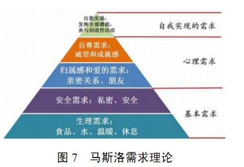

# 理论方法

## 理论
* [西方管理学三大定律：彼得原理、墨菲定律、帕金森定律](http://www.chinavalue.net/Management/Blog/2007-8-2/16069.aspx)

| 项 | 总结 | 说明 |
| :----: | ---- | ---- |
| [梅特卡夫定理](https://baike.baidu.com/item/%E6%A2%85%E7%89%B9%E5%8D%A1%E5%A4%AB%E5%AE%9A%E7%90%86/5195301) | 网络的价值与联网用户数的平方成正比 | 以太网络发明人罗伯特·梅特卡夫 |
| [康威定律](https://yq.aliyun.com/articles/8611) | 组织形式等同系统设计 |  |

### 马斯洛理论
* 

## 方法
* 企业竞争态势分析方法:SWOT
