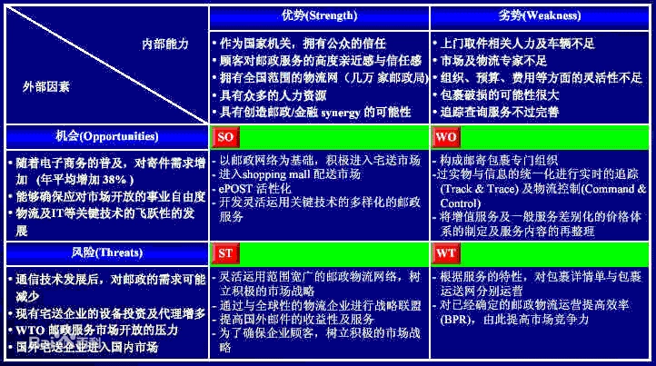
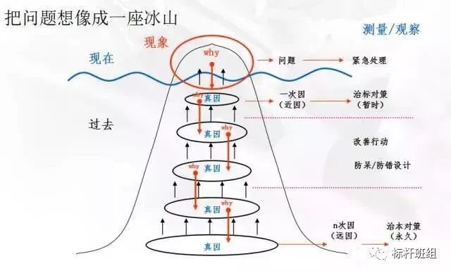

# 理论方法
## 管理
### 理论
* [西方管理学三大定律：彼得原理、墨菲定律、帕金森定律](http://www.chinavalue.net/Management/Blog/2007-8-2/16069.aspx)

| 项 | 总结 | 说明 |
| :-: | - | - |
| 彼得原理 | 在一个等级制度中，每个员工趋向于上升到他所不能胜任的地位 |  |
| 帕金森定律 | 一个不称职的人会任用两个水平比自己更低的人当助手 |  |
| 墨菲定律 | 事情如果有变坏的可能，不管这种可能性有多小，它总会发生 | 重视小概率事件 |
| [热炉法则](https://wiki.mbalib.com/wiki/%E7%83%AD%E7%82%89%E6%B3%95%E5%88%99) | 规章制度前人人平等 |  |
| [位差效应](https://wiki.mbalib.com/wiki/%E6%B2%9F%E9%80%9A%E7%9A%84%E4%BD%8D%E5%B7%AE%E6%95%88%E5%BA%94) | 平等交流是企业有效沟通的保证 | 来自领导层的信息只有20%-25%被下级知道并正确理解，而从下到上反馈的信息则不超过10%，平行交流的效率则可达到90%以上。 |
| [雷鲍夫法则](https://wiki.mbalib.com/wiki/%E9%9B%B7%E9%B2%8D%E5%A4%AB%E6%B3%95%E5%88%99) | 认识自己，尊重别人 |  |
| [古狄逊定理](https://wiki.mbalib.com/wiki/%E5%8F%A4%E7%8B%84%E9%80%8A%E5%AE%9A%E7%90%86) | 不做一个被累坏的主管(管理是让别人干活的艺术) |  |
| [布利丹效应](https://wiki.mbalib.com/wiki/%E5%B8%83%E5%88%A9%E4%B8%B9%E6%95%88%E5%BA%94) | 遇事要决策 |  |
| [波特定律](https://wiki.mbalib.com/wiki/%E6%B3%A2%E7%89%B9%E5%AE%9A%E5%BE%8B) | 下级往往只记住批评的开头 | 宽容面对错误，变责怪为激励，变惩罚为鼓舞，让其在接受惩罚时怀着感激之情，进而达到激励的目的。不同人采用不同的批评方法。 |
| [马蝇效应](https://wiki.mbalib.com/wiki/%E9%A9%AC%E8%9D%87%E6%95%88%E5%BA%94) | 再懒惰的马，只要身上有马蝇叮咬，它也会精神抖擞，飞快奔跑 |  |
| [二八原则（帕累托法则）]() | 总结果的80%是由总消耗时间中的20%所形成的 | 把资源用在最重要、最紧迫的事情上 |

### 方法
| 项 | 适用 | 内容 | 说明 |
| :-: | - | - | - |
| 管理4R法则 | 下属管理 | 明确提出要求、尊重下属、表扬亮点、全面评估下属 |  |
| 沟通7C法则 | 有效沟通 | 7个要求：正确、完整、言之有物、清晰、礼貌、简明、体贴 |  |
| 5S管理 | 现场管理 | 整理、整顿、清扫、清洁、素养 | 生产型企业 |
| 提案制度(丰田) | 有效沟通 | 1. 多提方案比提出好的方案更有价值   2. 不能对员工的提案用评论家的口气提出质疑   3. 没有代替方案就别轻言反对 |  |
| 团队管理 | 下属管理 | 1. 对表：给自己和下属设定明确可执行的目标   2. 切磋：经常和下属以及下属的下属一起头脑风暴如何达成目标   3. 算帐：期末考核并兑现奖惩   4. 复盘：抛开对错回顾得失总结经验 | 对表和算帐是管理，切磋和复盘是指导 |

## 做事
### 方法
| 项 | 适用 | 内容 | 说明 |
| :-: | - | - | - |
| SWOT分析 | 企业战略分析 | 内部的优势和劣势、外部的机会和威胁 |  |
| SMART法则 | 工作-目标制定 | 目标的5项标准：明确的(Specific)、可衡量的(Measurable)、可达成的(Achievable)、相关的(Relevance)、有时限的(Timeliness) | Specific : 模棱两可的目标会让执行的时候觉得无所适从   Measurable : 采用可量化的指标   Achievable : 盲目追求不切实际的要求会给项目带来灾难性的后果   Relevance : 要和项目本身具有很强的相关性   Timeliness : 要有时间限制 |
| PDCA | 工作-流程 | 计划、执行、检查、行动 | PDCA循环 |
| 5W2H | 工作-明确 | 何因(why）、何事(what)、何人(why）、何时(when)、何地(where）、如何做(how)、何价(how much) |  |
| 8D步骤 | 工作-解决问题 | 成立小组、问题说明、实施并验证临时措施、确定并验证根本原因、选择确认纠正措施、实施纠正措施、预防再发生、祝贺小组 |  |
| 5Why分析法 | 工作-问题原因分析 | 对同一个问题，进行连续的提问，可能是3次，可能是5次，也可能是10次，直到能发现最根本的原因为止 |  |
| 鱼骨图分析法（5M因素分析法） | 工作-问题原因分析 | 五大要素：人、机、物、法、环 | 将问题可能原因分为几大类，在大类之下，查找可能的细分原因,从而锁定真正的问题原因 |
| 时间四象限 | 时间管理 | 按重要性和紧急度分为4象限：重要紧急、重要不紧急、紧急不重要、不重要不紧急 |  |
| KISS复盘 | 项目质量管理 | Keep：做的好的继续保持   Improve：可以改进的   Start：需要开始做的事情   Stop：需要停止的事情 |  |

### SWOT分析表
* 

### 5Why分析法
#### 案例
* 大野耐一先生见到生产线上的机器总是停转，虽然修过多次但仍不见好转，便上前询问现场的工作人员。

| 正确提问 | 正确回答 | 错误回答 | 错误提问 |
| - | - | - | - |
| 为什么机器停了? | 因为超过了负荷，保险丝就断了 | 因为排工过多，机器的承受能力不足【不思考】 | / |
| 为什么超负荷呢? | 因为轴承的润滑不够。 | / | 为什么不选用更好的保险丝?【不是根本原因】 |
| 为什么润滑不够? | 因为润滑泵吸不上油来。 因为润滑油的品质存在缺陷，非常粘稠。 | / | 为什么只是轴承部分润滑不够呢？【误导到讨论轴承】 |
| 为什么吸不上油来? | 因为油泵轴磨损、松动了。 | / | / |
| 为什么磨损了呢? | 因为没有安装过滤器，混进了铁屑等杂质。 | 这属于正常磨损，完全在接受范围之内【要找原因】 | / |

* 华盛顿的杰弗逊纪念馆。上世纪80年代，美国政府发现华盛顿的杰弗逊纪念馆墙壁受腐蚀损坏严重，于是请了专家来调查。

| 正确提问 | 正确回答 | 错误回答 | 错误提问 |
| - | - | - | - |
| 为什么墙壁受腐蚀损坏严重？ | 酸雨侵蚀【进一步实验发现酸雨的不会有这么大的破坏，且其他房子没有腐蚀（不是根本原因）。】 | / | / |
| 为什么杰弗逊纪念馆受酸雨影响比别的建筑物更严重？ | 冲洗墙壁所用的清洁剂对建筑物有腐蚀作用，该大厦墙壁每年被冲洗的次数大大多于其他建筑，腐蚀自然更加严重。 | / | / |
| 为什么要经常清洗？ | 大厦被大量的燕粪弄得很脏。 | / | / |
| 为什么会那么多的燕粪呢？ | 大厦周围生活着很多燕子。 | / | / |
| 为什么燕子喜欢聚集到这里? | 建筑物上有它们喜欢吃的蜘蛛。 | / | / |
| 为什么会有蜘蛛？ | 蜘蛛爱在这里安巢，是因为墙上有大量它们爱吃的飞虫。 | / | / |
| 为什么有这么多飞虫？ | 因为大量的飞虫被黄昏的灯光吸引。 | / | / |

* 使用没有腐蚀性的清洁剂、捕杀燕子、杀死蜘蛛、杀死飞虫......这些都可以视为有效地改进措施。“黄昏的灯光吸引飞虫“是根本的原因，“拉上窗帘”是解决措施。杰弗逊纪念馆的问题就这么轻易解决了。大厦至今完好无损。

#### 方法说明
* 知道真正原因可以治标和改进，还必须清楚**最根本的原因(治本)**

* 使用重点
    * 提问者不仅要问“为什么”，还需要准确把握问题的核心，提出正确的问题。
    * 提问者能准确把握对方的回答是否是真正的原因
    * 客观事实，非推论
* **正确的问题**   
    * 《麦肯锡传奇》 : “企业倒闭最常见的原因不是因为对正确的问题提出了错误的答案，而是因为对错误的问题提出了正确的答案。”
    * 找准问题点是避免决策误入歧途的不二法门
* 资料
    * [华盛顿的杰弗逊纪念馆案例](https://zhuanlan.zhihu.com/p/28506456)
    * [资料](https://www.sohu.com/a/208170456_160920)

## 学习
1. [费曼学习法](https://www.amazon.cn/dp/B08XM4MW6C)：以教代学，让输出倒逼输入
    1. 输出思维
    1. 简化思维

## 其他理论
| 项 | 总结 | 说明 |
| :-: | - | - |
| [梅特卡夫定理](https://baike.baidu.com/item/%E6%A2%85%E7%89%B9%E5%8D%A1%E5%A4%AB%E5%AE%9A%E7%90%86/5195301) | 网络的价值与联网用户数的平方成正比 | 以太网络发明人罗伯特·梅特卡夫 |
| [康威定律](https://yq.aliyun.com/articles/8611) | 组织架构决定产品结构 | 微服务开发需要组织架构支持 |
| [DISC性格模型](https://zhuanlan.zhihu.com/p/347001659) | 支配型，影响型,稳健型以及谨慎型 | 行为风格、行为模式 |

### 马斯洛理论
* 

### 中国思想
| 项 | 总结 | 说明 |
| :-: | - | - |
| 千金买马骨 | 做任何事都应该用实际行动表明自己的诚意 |  |